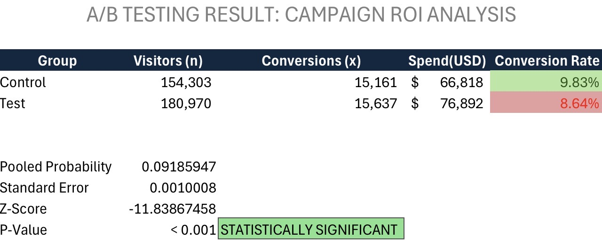

# A/B Testing & ROI Analysis: Digital Campaign Profitability

## Executive Summary
Evaluating the performance and profitability of two digital marketing campaigns (Control vs. Test) to mathematically determine, via statistical validation, if a new acquisition strategy justifies its increased budget.

## Tech Stack
* **SQL:** Transactional data extraction, cleaning, and aggregation.
* **Advanced Excel:** Statistical analysis (Two-Proportion Z-Test, P-Value), financial modeling, and business reporting.

## The Business Problem
The marketing team invested an additional $10,000 into a new "Test" campaign aimed at driving higher website traffic. The purpose of this analysis is to mathematically determine if this traffic surge translated into a statistically significant improvement in the **Conversion Rate (CR)** compared to the original "Control" campaign.

## Executive Dashboard & Statistical Results


## Key Findings & Strategic Recommendation
After analyzing the behavior of over 335,000 website visitors, the data revealed the following:

1. **Drop in Efficiency:** Despite generating a higher volume of traffic, the Test campaign recorded a lower conversion rate (**8.64%**) compared to the Control campaign (**9.83%**).
2. **Statistical Validation:** The Z-Test yielded a Z-Score of **-11.83** and a P-Value of **< 0.001**, confirming that the drop in performance is definitive and not a result of random variance.

> **Executive Decision:** It is highly recommended to **halt the Test campaign immediately** to stop further capital loss. The surplus budget should be reallocated to the Control campaign, which has proven to be a financially stable and highly profitable acquisition channel.

## SQL Extraction Code
Structured query used to clean null values and consolidate over 60 transactional records into the core metrics used for the statistical test:

```sql
-- A/B Testing: Key Metrics Extraction
-- Filtering null values to ensure data integrity and accuracy

SELECT 
    'Control Campaign' AS Campaign_Group,
    COUNT(Date) AS Days_Run,
    SUM(Spend_USD) AS Total_Spend,
    SUM(Website_Clicks) AS Total_Visitors,
    SUM(Purchase) AS Total_Conversions
FROM control_group
WHERE Website_Clicks IS NOT NULL AND Purchase IS NOT NULL

UNION ALL

SELECT 
    'Test Campaign' AS Campaign_Group,
    COUNT(Date) AS Days_Run,
    SUM(Spend_USD) AS Total_Spend,
    SUM(Website_Clicks) AS Total_Visitors,
    SUM(Purchase) AS Total_Conversions
FROM test_group
WHERE Website_Clicks IS NOT NULL AND Purchase IS NOT NULL;
